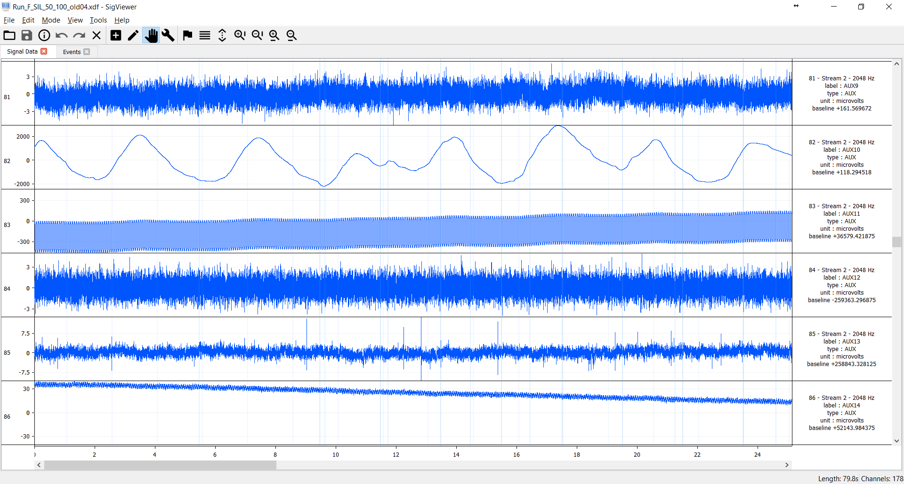

# Libxdf - a C++ library for loading [XDF](https://github.com/sccn/xdf/wiki/Specifications "Extensible Data Format") files

[](http://www.repostatus.org/#active)
[](https://opensource.org/licenses/BSD-2-Clause)

* [Introduction](#intro)
* [Download](#download)
* [Quick-Start Guide](#quick)
* [Documentation](#doc)
* [Reference](#reference)
* [Support](#support)


## <a name="intro"></a>Introduction

Libxdf is a cross-platform C++ library for loading multi-modal, multi-rate signals stored in [XDF](https://github.com/sccn/xdf/wiki/Specifications  "Extensible Data Format") files.
Libxdf is used in the  biosignal viewing application [SigViewer](https://github.com/cbrnr/sigviewer). It can also be integrated into other
C++ applications.

Libxdf is open-source, free, and actively maintained.


## <a name="download"></a>Download

* [Source code (zip)](https://github.com/Yida-Lin/libxdf/archive/0.94.zip)
* [Source code (tar.gz)](https://github.com/Yida-Lin/libxdf/archive/0.94.tar.gz)
* [Pre-built binaries](https://github.com/Yida-Lin/libxdf/releases)

## <a name="quick"></a>Quick-Start Guide

### Building libxdf
Libxdf can be conveniently built either using `qmake` or `cmake`. Configuration files for both build tools are included with the source.

`cmake` builds a static library by default, but you can build a shared library
by setting the
[`BUILD_SHARED_LIBS`](https://cmake.org/cmake/help/latest/variable/BUILD_SHARED_LIBS.html)
variable (e.g. `-DBUILD_SHARED_LIBS=ON`).

### Use in conjunction with [SigViewer](https://github.com/cbrnr/sigviewer)

Libxdf is a built-in component of [SigViewer](https://github.com/cbrnr/sigviewer). If you wish to build SigViewer from source, follow these steps:

1. Download `xdf.h` and `libxdf.a` from the [release](https://github.com/Yida-Lin/libxdf/releases) page.
2. Copy `xdf.h` into `sigviewer/external/include`
3. Copy `libxdf.a` into `sigviewer/external/lib`
4. Build and run Sigviewer




Example: SigViewer using _libxdf_ to display signals in an XDF file.

### Use in other C++ applications

1. Build libxdf from source or use a pre-built binary release
2. Instantiate an object of the `Xdf` class and call the `load_xdf` method.

Example:

```C++
#include "xdf.h"

Xdf xdf;
xdf.load_xdf("C:/example.xdf");
```

To resample the signals, e.g. to 100Hz:

```C++
xdf.resample(100);
```

The methods in libxdf must be called following a certain order. For instance, if you call the `detrend` method before you load any data, it will cause undefined behavior.

The recommended order is shown here. Only `load_xdf` is mandatory.

```C++
xdf.load_xdf(std::string filepath);
xdf.detrend();
xdf.create_labels();
xdf.resample(int sampling_rate);
xdf.free_up_time_stamps();
```

Libxdf depends on third party libraries [Pugixml v1.8](http://pugixml.org/) for XML parsing and [Smarc](http://audio-smarc.sourceforge.net/) for resampling.

## <a name="doc"></a> Documentation
[Documentation](docs/html/class_xdf.html) was generated via [Doxygen](http://www.stack.nl/~dimitri/doxygen/index.html).

## <a name="reference"></a> Reference
If you use this code in your project, please cite:
```
Yida Lin, Clemens Brunner, Paul Sajda and Josef Faller. SigViewer: Visualizing Multimodal Signals Stored in XDF (Extensible Data Format) Files. The 39th Annual International Conference of the IEEE Engineering in Medicine and Biology Society.
```
Direct link: https://arxiv.org/abs/1708.06333

Bibtex format:
```
@article{lin2017sigviewer,
  title={SigViewer: visualizing multimodal signals stored in XDF (Extensible Data Format) files},
  author={Lin, Yida and Brunner, Clemens and Sajda, Paul and Faller, Josef},
  journal={arXiv},
  pages={arXiv--1708},
  year={2017}
}
```

## <a name="support"></a>Support
[Email author](mailto:yl3842@columbia.edu) or report a new [issue](https://github.com/Yida-Lin/libxdf/issues).
